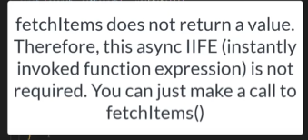

## for run json-server 
`npx json-server -p 3000 -w src/data/db.json` where -p stand for the port number and -w stand for watch 

 

##  Http networking

<!-- 304 mean is used cached information it means it doesn't  really need to get that infromation from the server because nothing has changed 

404 Error 

200 is ok  -->